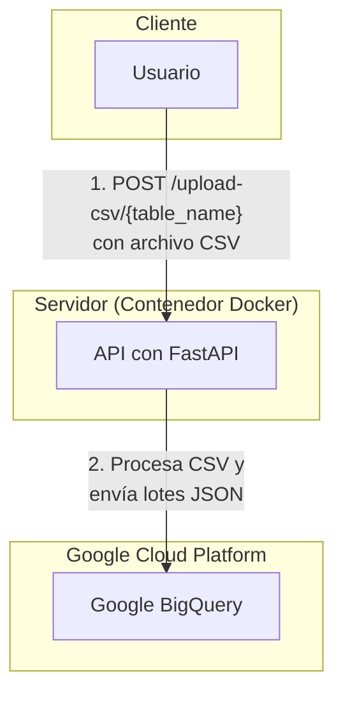

# Desafío de Ingeniería de Datos - Globant V. 1.00

Este repositorio contiene la solución el desafío de codificación de Ingeniería de Datos. El proyecto es una API construida con FastAPI que implementa un pipeline de ingesta de datos robusto: recibe archivos CSV, los procesa, y los inserta en Google BigQuery en lotes controlados.

## Lógica de Ingesta

La API recibe un archivo CSV a través de un endpoint. El código lee el archivo en memoria, línea por línea, y agrupa las filas en lotes (chunks) de hasta 1000 registros. Cada lote se convierte a formato JSON y se inserta en BigQuery mediante el método de "streaming inserts".

## Arquitectura

*   **Framework de API:** FastAPI (Python)
*   **Almacén de Datos:** Google BigQuery
*   **Autenticación con GCP:** Cuenta de Servicio (Service Account)
*   **Contenerización:** Docker

### Diagrama de Flujo

El siguiente diagrama ilustra el flujo de datos desde el usuario hasta la base de datos.



---

## Cómo Ejecutar el Proyecto

Existen dos métodos para ejecutar la aplicación: directamente en un entorno local de Python o utilizando Docker (recomendado para consistencia y despliegue).

### Prerrequisitos Generales

*   Python 3.8+
*   Docker Desktop instalado y en ejecución.
*   Un proyecto en Google Cloud con la API de BigQuery habilitada.
*   Haber clonado este repositorio.

### Configuración de Credenciales (Necesario para ambos métodos)

Antes de empezar, debes configurar tus credenciales de Google Cloud:

1.  **Cuenta de Servicio:** Asegúrate de tener un archivo de credenciales JSON de una cuenta de servicio de GCP con el rol `Editor de datos de BigQuery`.
2.  **Renombrar y Mover:** Coloca el archivo de credenciales en la raíz del proyecto y renómbralo a `gcp-credentials.json`.
3.  **Archivo `.env`:** Crea un archivo llamado `.env` en la raíz del proyecto y añade la siguiente configuración, reemplazando los valores correspondientes:
    ```ini
    GOOGLE_APPLICATION_CREDENTIALS="gcp-credentials.json"
    GCP_PROJECT_ID="tu-id-de-proyecto-gcp"
    BIGQUERY_DATASET_ID="globant_challenge_dataset"
    ```

---

### Método 1: Ejecutar Localmente (Entorno Virtual de Python)

Este método es ideal para el desarrollo y la depuración rápida.

1.  **Crear y activar un entorno virtual:**
    ```bash
    # En Windows
    python -m venv venv
    .\venv\Scripts\activate

    # En macOS/Linux
    python -m venv venv
    source venv/bin/activate
    ```

2.  **Instalar las dependencias:**
    ```bash
    pip install -r requirements.txt
    ```

3.  **Iniciar la API:**
    ```bash
    uvicorn app.main:app --reload
    ```

---

### Método 2: Ejecutar con Docker (Recomendado)

Este método empaqueta la aplicación en un contenedor, asegurando que funcione de la misma manera en cualquier entorno.

1.  **Construir la Imagen de Docker:**
    Desde la raíz del proyecto, ejecuta el siguiente comando. Esto leerá el `Dockerfile` y creará una imagen autocontenida de tu aplicación llamada `globant-challenge-api`.
    ```bash
    docker build -t globant-challenge-api .
    ```

2.  **Ejecutar el Contenedor:**
    El siguiente comando iniciará un contenedor desde la imagen que acabas de construir, pasando de forma segura tus credenciales y configuración.

    **En Windows (PowerShell/CMD):**
    ```bash
    docker run -d -p 8000:8000 --env-file ./.env -v "%cd%\gcp-credentials.json:/app/gcp-credentials.json:ro" --name globant-api globant-challenge-api
    ```

    **En macOS/Linux:**
    ```bash
    docker run -d -p 8000:8000 --env-file ./.env -v "$(pwd)/gcp-credentials.json:/app/gcp-credentials.json:ro" --name globant-api globant-challenge-api
    ```
    *   `-d`: Ejecuta el contenedor en segundo plano.
    *   `-p 8000:8000`: Mapea el puerto 8000 de tu máquina al puerto 8000 del contenedor.
    *   `--env-file ./.env`: Pasa tus variables de entorno al contenedor.
    *   `-v ...`: Monta tu archivo de credenciales JSON dentro del contenedor en modo de solo lectura.

---

## Acceder a la API

Independientemente del método que uses, el servidor estará disponible en `http://127.0.0.1:8000`.

*   **Documentación Interactiva:** `http://127.0.0.1:8000/docs`

### Endpoint Principal

*   **`POST /upload-csv/{table_name}`**
    *   Recibe un archivo CSV y lo inserta en la tabla de BigQuery especificada (`departments`, `jobs`, o `hired_employees`) en lotes de hasta 1000 filas.